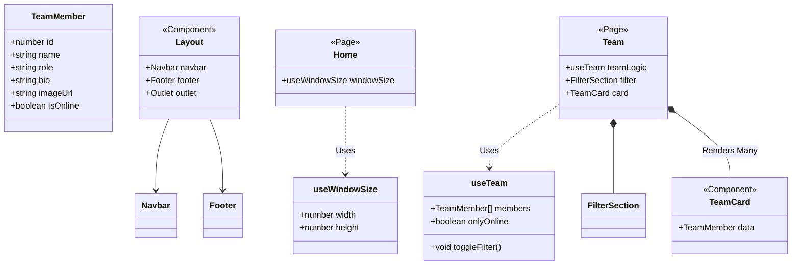

# Data & Component Structure (SoC)

```mermaid
classDiagram
    class TeamMember {
        +number id
        +string name
        +string role
        +string bio
        +string imageUrl
        +boolean isOnline
    }

    class useTeam {
        +TeamMember[] members
        +boolean onlyOnline
        +void toggleFilter()
    }

    class useWindowSize {
        +number width
        +number height
    }

    class Layout {
        <<Component>>
        +Navbar navbar
        +Footer footer
        +Outlet outlet
    }

    class Home {
        <<Page>>
        +useWindowSize windowSize
    }

    class Team {
        <<Page>>
        +useTeam teamLogic
        +FilterSection filter
        +TeamCard card
    }

    class TeamCard {
        <<Component>>
        +TeamMember data
    }

    Layout --> Navbar
    Layout --> Footer
    Home ..> useWindowSize : Uses
    Team ..> useTeam : Uses
    Team *-- FilterSection
    Team *-- TeamCard : Renders Many
```